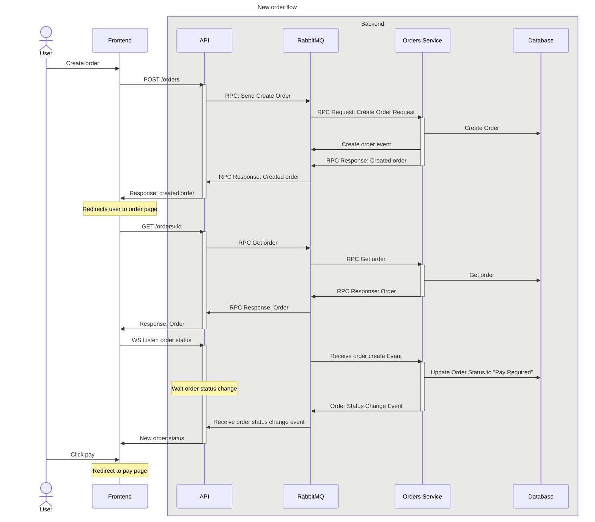
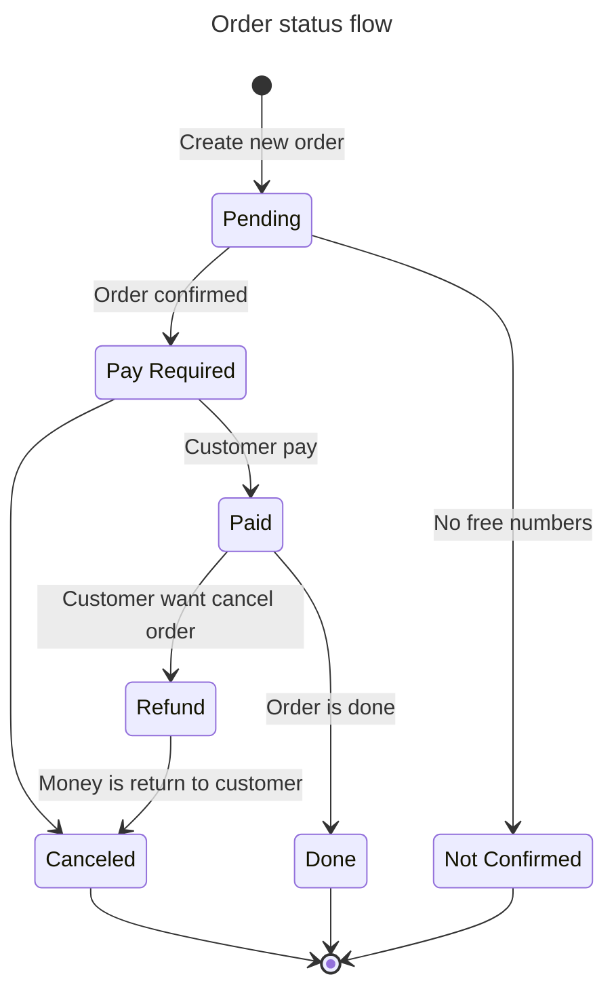

```mermaid
---
title: New order flow
---
sequenceDiagram
    actor User
    participant Frontend
    box rgba(227, 227, 222, 0.3) Backend
      participant API
      participant RabbitMQ
      participant Orders Service
      participant Database
    end

    User->>Frontend: Create order
    Frontend->>API: POST /orders
    activate API
    API->>RabbitMQ: RPC: Send Create Order
    RabbitMQ->>Orders Service: RPC Request: Create Order Request
    activate Orders Service
    Orders Service->>Database: Create Order
    Orders Service->>RabbitMQ: Create order event
    Orders Service->>RabbitMQ: RPC Response: Created order
    deactivate Orders Service
    RabbitMQ->>API: RPC Response: Created order
    API->>Frontend: Response: created order
    deactivate API
    Note over Frontend, Frontend: Redirects user to order page
    Frontend ->> API: GET /orders/:id
    activate API
    API ->> RabbitMQ: RPC Get order
    RabbitMQ ->> Orders Service: RPC Get order
    activate Orders Service
    Orders Service ->> Database: Get order
    Orders Service ->> RabbitMQ: RPC Response: Order
    deactivate Orders Service
    RabbitMQ ->> API: RPC Response: Order
    API ->> Frontend: Response: Order
    deactivate API
    Frontend ->> API: WS Listen order status
    activate API
    RabbitMQ->>Orders Service: Receive order create Event
    activate Orders Service
    Orders Service->>Database: Update Order Status to "Pay Required"
    Note over API, API: Wait order status change
    Orders Service->>RabbitMQ: Order Status Change Event
    deactivate Orders Service
    RabbitMQ ->> API: Receive order status change event
    API ->> Frontend: New order status
    deactivate API
    User ->> Frontend: Click pay
    Note over Frontend, Frontend: Redirect to pay page
```

```mermaid
---
title: Order status flow
---
stateDiagram-v2
  state "Pay Required" as PayRequired
  state "Not Confirmed" as NotConfirmed
  [*] --> Pending: Create new order
  Pending --> NotConfirmed: No free numbers
  Pending --> PayRequired: Order confirmed
  PayRequired --> Paid: Customer pay
  PayRequired --> Canceled
  Paid --> Done: Order is done
  Paid --> Refund: Customer want cancel order
  Refund -->Canceled: Money is return to customer
  Canceled --> [*]
  Done --> [*]
  NotConfirmed --> [*]
```
